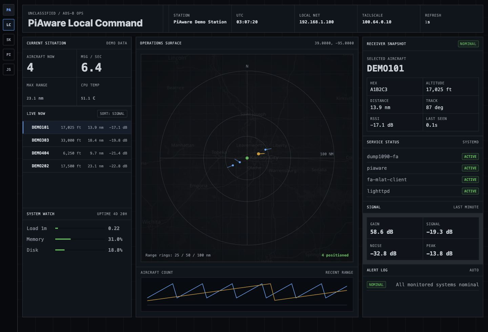

# PiAware Dashboard

A lightweight local dashboard for a Raspberry Pi running
[FlightAware PiAware](https://github.com/flightaware/piaware). It shows receiver
health, Raspberry Pi system status, network state, service status, ADS-B
activity, and a compact aircraft/range display.

The dashboard is designed for small PiAware stations: no Node.js, no database,
no build step, and no external web services. It runs as a tiny Python
standard-library web server and serves static HTML/CSS/JavaScript.



## Features

- Pi system health: load, memory, disk, CPU temperature, uptime.
- Network status: local interface and Tailscale address when present.
- PiAware ADS-B data from `dump1090-fa` runtime JSON.
- Aircraft count, positioned tracks, messages per second, range history, signal,
  noise, gain, peak signal, and a fixed-scale receiver-centered map plot.
- Systemd status for `dump1090-fa`, `piaware`, `fa-mlat-client`, and `lighttpd`.
- Links to the host device's SkyAware page, PiAware page, and aircraft JSON.
- Palantir-inspired operations-console visual design.

## Requirements

- Raspberry Pi running PiAware / `dump1090-fa`.
- Python 3.
- systemd.
- Existing PiAware web interface, usually available at:

```text
http://<your-pi-address>/
http://<your-pi-address>/skyaware/
```

## Quick Install

On your Raspberry Pi:

```bash
git clone https://github.com/B1ackCat7/PiAware-Dashboard.git
cd PiAware-Dashboard
sudo ./install.sh
```

Then open:

```text
http://<your-pi-address>:8088/
```

The service uses port `8088` by default, so it does not replace or modify the
existing PiAware/SkyAware interface on port `80`.

## Manual Run

For development or testing:

```bash
python3 -B server.py
```

Then open:

```text
http://127.0.0.1:8088/
```

On a non-PiAware machine, the app shows generic demo data so the interface can
be previewed without receiver hardware.

To force sanitized demo data for screenshots or local previews:

```bash
PIAWARE_DASHBOARD_DEMO=1 python3 -B server.py
```

## Service Commands

```bash
sudo systemctl status piaware-dashboard.service
sudo systemctl restart piaware-dashboard.service
sudo systemctl stop piaware-dashboard.service
```

Logs:

```bash
journalctl -u piaware-dashboard.service -f
```

## Configuration

The service file sets:

```text
PIAWARE_DASHBOARD_HOST=0.0.0.0
PIAWARE_DASHBOARD_PORT=8088
```

To change the port, edit:

```text
/etc/systemd/system/piaware-dashboard.service
```

Then run:

```bash
sudo systemctl daemon-reload
sudo systemctl restart piaware-dashboard.service
```

### Map Tiles

The center range display can show a greyscale base map behind the aircraft plot.
It is centered automatically from the receiver latitude/longitude reported by
`dump1090-fa`, so each installation uses that station's own location.

By default, browsers load public OpenStreetMap raster tiles:

```text
https://tile.openstreetmap.org/{z}/{x}/{y}.png
```

To use a local or custom tile server, set:

```text
PIAWARE_DASHBOARD_TILE_URL=http://<tile-server>/{z}/{x}/{y}.png
```

To disable the base map and keep only the radar-style plot:

```text
PIAWARE_DASHBOARD_TILE_URL=none
```

## Uninstall

From the cloned repo:

```bash
sudo ./uninstall.sh
```

## Data Sources

The server reads:

```text
/run/dump1090-fa/aircraft.json
/run/dump1090-fa/stats.json
/run/dump1090-fa/receiver.json
```

It also reads standard Linux system files and `systemctl` status for local
machine health.

## Privacy

The dashboard API does not send receiver data anywhere. Everything is served
locally from the Raspberry Pi. If the default base map is enabled, the browser
viewing the dashboard requests map tiles from OpenStreetMap for the receiver's
general area. Set `PIAWARE_DASHBOARD_TILE_URL=none` or point it at a local tile
server for fully offline operation.
